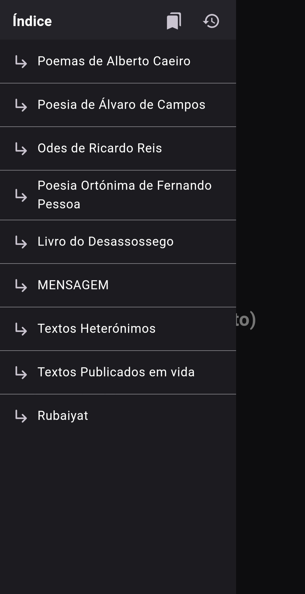
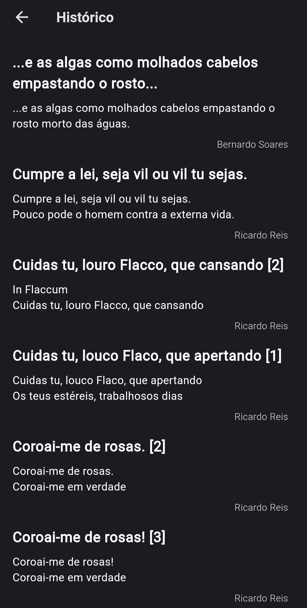

# Pessoa Pensadora

Uma aplicação para ler os textos de [Fernando Pessoa](https://pt.wikipedia.org/wiki/Fernando_Pessoa), provenientes de [Arquivo Pessoa](http://arquivopessoa.net/).

Criada para serem lidos numa interface mais moderna e de fácil leitura no telemóvel.

> **Nota**: esta aplicação não possui qualquer afiliação ao website [Arquivo Pessoa](http://arquivopessoa.net/info/ficha), exceto a extração dos textos do mesmo.

## Imagens

    

### Funcionalidades

   

## Textos removidos

A aplicação começou por ser desenvolvida com o objetivo de eu próprio ler a poesia de Fernando Pessoa, pelo que apenas incluí as categorias que me interessavam. (os que se podem ver acima no Índice)

Dado que agora reconheço a utilidade da aplicação para fins académicos e até mesmo para outros entusiastas de Fernando Pessoa, no futuro irei colocar uma opção para ler a sua obra na íntegra.

## Reportar problemas

Para problemas com a aplicação, peço que cries um issue aqui no GitHub, descrevendo o problema com _screenshots_ e/ou vídeo e os passos para reproduzir o problema.

## Developer docs (english)

### Building

Run the code generator first: `dart run build_runner build`.

Then run as normal. (via IDE or `fluter run --debug --flavor dev`)
