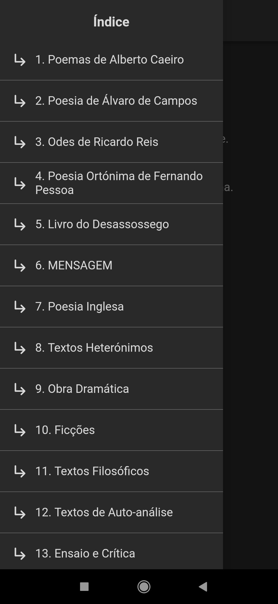
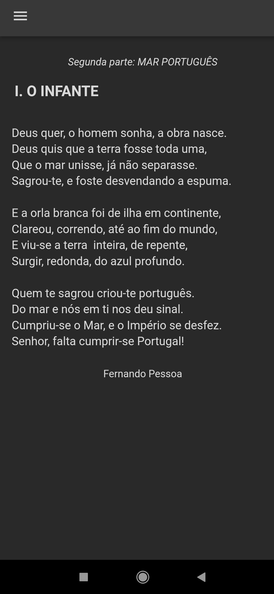

# PessoaBonito

Uma aplicação para ler os textos de [Fernando Pessoa](https://pt.wikipedia.org/wiki/Fernando_Pessoa), provenientes de [Arquivo Pessoa](http://arquivopessoa.net/).

Criada para serem lidos numa interface mais moderna e de fácil leitura no telemóvel.

## Imagens

    

## Developer docs (english)

### Building

Run the code generator first: `dart run build_runner build`.

Then run as normal. (via IDE or `fluter run --debug --flavor dev`)
