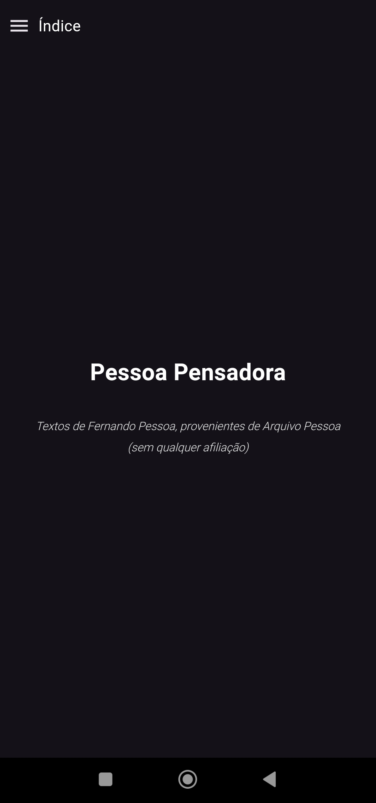
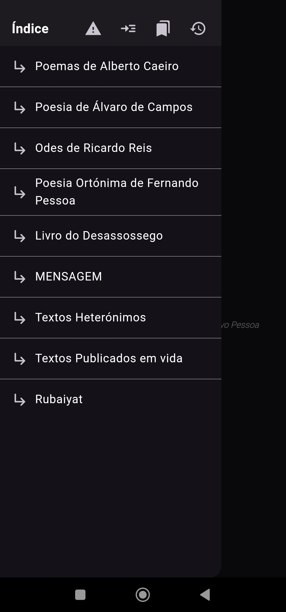
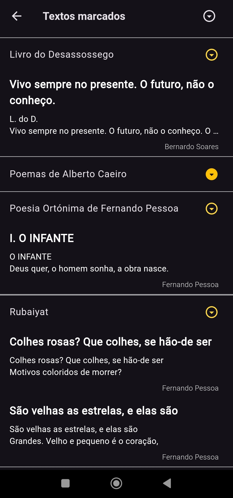
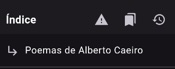

# Pessoa Pensadora

Uma aplicação para ler os textos de [Fernando Pessoa](https://pt.wikipedia.org/wiki/Fernando_Pessoa), provenientes de [Arquivo Pessoa](http://arquivopessoa.net/).

Criada para serem lidos numa interface mais moderna e de fácil leitura no telemóvel.

> **Nota**: esta aplicação não possui qualquer afiliação ao website [Arquivo Pessoa](http://arquivopessoa.net/info/ficha), exceto a extração dos textos do mesmo.
> 

## Imagens

    

### Funcionalidades

   

## Textos removidos

A aplicação começou por ser desenvolvida com o objetivo de eu próprio ler a poesia de Fernando Pessoa, pelo que apenas incluí as categorias que me interessavam. (os que se podem ver acima no Índice)

Dado que agora reconheço a utilidade da aplicação para fins académicos e até mesmo para outros entusiastas de Fernando Pessoa, no futuro irei colocar uma opção para ler a sua obra na íntegra.

## Reportar problemas

Para problemas com a aplicação, peço que cries um issue aqui no GitHub, descrevendo o problema com _screenshots_ e/ou vídeo assim como os passos tomados para poder reproduzir o problema.

Em alternativa, utiliza o botão na aplicação para reportar problemas, via e-mail.

  

## Nota importante

Não é permitido redistribuir ou reutilizar/alterar o código aqui presente para fins lucrativos.

A aplicação é, e será **sempre**, **gratuita e de código aberto**.

## Developer docs (english)

### Building

Run the code generator first: `dart run build_runner build`.

Then run as normal. (via IDE or `fluter run --debug --flavor dev`)

## Notice for non-Portuguese speakers

The app is solely in Portuguese with no plans for translation because although Fernando Pessoa does have English texts, these are not the focus of the application.
